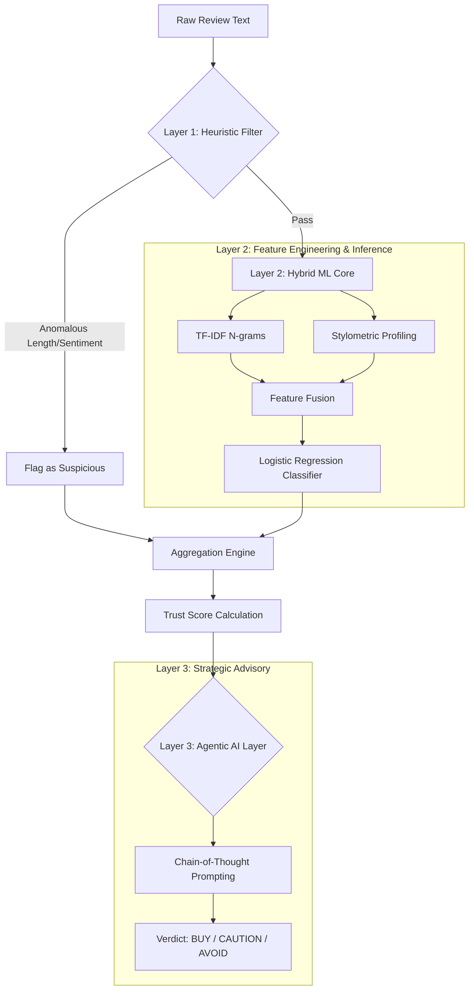

# 🛡️ FakeScope: Advanced Hybrid Fake Review Detection

[](https://www.python.org/downloads/)
[](https://streamlit.io/)
[](https://opensource.org/licenses/MIT)

**FakeScope** is a high-performance, multi-layered system designed to detect deceptive reviews across major e-commerce platforms like Amazon and Flipkart. By combining classical machine learning, stylometric analysis, and specialized LLM advisory agents, FakeScope provides a robust and explainable "Trust Score" for any given product.

---

## 🌟 Key Features

*   **🛡️ 3-Layer Detection Pipeline**: A sophisticated defense system consisting of rule-based filters, hybrid ML classification, and an agentic AI advisory layer.
*   **📊 Explainable Trust Score (0-100)**: Aggregates linguistic patterns, behavioral heuristics, and sentiment analysis into a single, intuitive metric.
*   **🤖 Agentic AI Advisory**: Leverages LLMs (via Groq) to provide qualitative analysis and a final "Buy/Avoid" verdict.
*   **📈 Proven Accuracy (87.2%)**: Outperforms standard zero-shot models (like BERT) through domain-specific training on deceptive text stylings.
*   **📄 HTML File Upload**: Accepts saved Amazon HTML files for offline review extraction using BeautifulSoup, bypassing platform authentication restrictions.

---

## 🏗️ System Architecture

FakeScope operates on a three-tier hierarchy to ensure both speed and depth of analysis:



---

## 📂 Project Structure

```text
Fake_Review_Project/
├── data/                   # Raw and processed datasets (Yelp/Amazon)
├── models/                 # Serialized hybrid models (.pkl)
├── notebooks/              # Exploratory Data Analysis (EDA)
├── src/                    # Core source code
│   ├── dashboard.py        # Streamlit-based UI
│   ├── retrain_pipeline.py # Model training & evaluation
│   ├── amazon_scraper.py   # Web scraper utilities
│   └── ...                 # Modular analysis scripts
├── requirements.txt        # Project dependencies
└── README.md               # Project documentation
```

---

## 🛠️ Installation & Setup

### 1. Prerequisite Checklist
- Python 3.9 or higher
- Git
- [Groq API Key](https://console.groq.com/) (for the AI Advisory Layer)

### 2. Quick Start
```bash
# Clone the repository
git clone https://github.com/Rishikeshvg/FakeScope.git
cd FakeScope

# Initialize environment
python -m venv venv
source venv/bin/activate  # On Windows: venv\Scripts\activate

# Install dependencies
pip install -r requirements.txt
```

### 3. Environment Configuration
Create a `.env` file in the root directory:
```env
GROQ_API_KEY=your_api_key_here
```

### 4. Launch the Application
```bash
python -m streamlit run src/dashboard.py
```

---

## 🧪 Methodology & Performance

### Model Comparison
Our hybrid approach focuses on "Stylometric Fingerprinting"—detecting the subtle linguistic tells of professional "review farmers" that LLMs often miss.

| Model | Accuracy | ROC-AUC | Note |
|-------|----------|---------|------|
| **FakeScope Hybrid** | **87.2%** | **0.951** | **Best-in-class** |
| Random Forest | 82.3% | 0.879 | Baseline |
| BERT (Zero-shot) | 49.0% | 0.500 | Poor domain fit |

### Core Innovation: Stylometric Layer
Unlike simple sentiment analysis, FakeScope evaluates:
- **Punctuation Density**: Fake reviews often over-emphasize with exclamation marks.
- **Part-of-Speech Distribution**: Truthful reviews use more descriptive adjectives; deceptive ones rely on generic superlatives.
- **Sentiment Divergence**: Detecting cases where the text sentiment mismatched the given star rating.

---

## 🛡️ Robustness & Evaluation

FakeScope has been validated using **McNemar’s Statistical Test** (p < 0.05) to ensure performance gains are consistent. It has also undergone **Adversarial Testing** to resist common "review farming" evasion techniques.

---

## 📜 License
This project is licensed under the MIT License - see the LICENSE file for details.

---

*Developed as a Capstone Project for advanced Fake Review Detection systems.*
